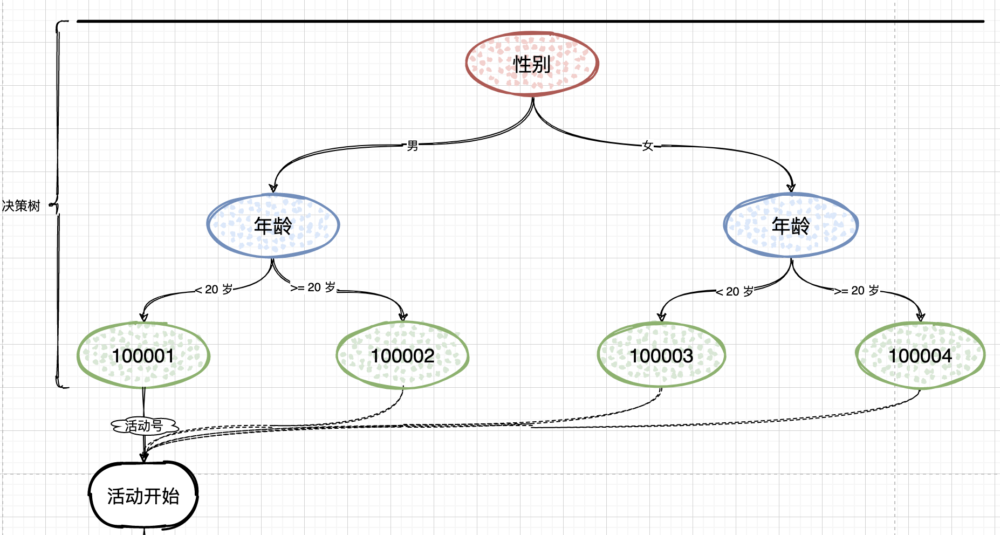
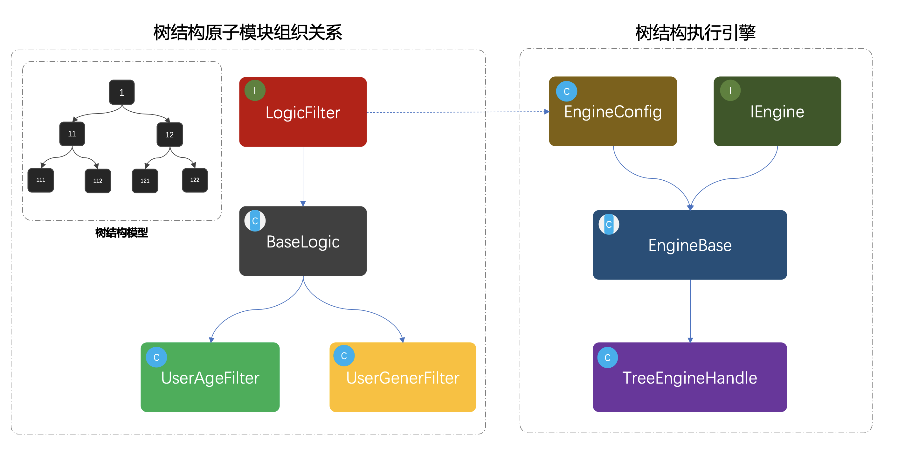

## 项目名称：规则引擎量化人群参与活动

- 分支：[211008_xfg_rule](https://gitcode.net/KnowledgePlanet/Lottery/-/tree/211008_xfg_rule)
- 描述：使用组合模式搭建用于量化人群的规则引擎，用于用户参与活动之前，通过规则引擎过滤性别、年龄、首单消费、消费金额、忠实用户等各类身份来量化出具体可参与的抽奖活动。通过这样的方式控制运营成本和精细化运营。

## 一、开发日志

- 增加规则引擎开发需要的相关的配置类表：rule_tree、rule_tree_node、rule_tree_node_line
- 运用组合模式搭建规则引擎领域服务，包括：logic 逻辑过滤器、engine 引擎执行器
- 修改 lottery-infrastructure 基础层中仓储实现类更为合适的的注解为 `@Repository` 包括：
  ActivityRepository、RuleRepository、StrategyRepository、UserTakeActivityRepository

## 二、库表设计

组合模式的特点就像是搭建出一棵二叉树，而库表中则需要把这样一颗二叉树存放进去，那么这里就需要包括：树根、树茎、子叶、果实。在具体的逻辑实现中则需要通过子叶判断走哪个树茎以及最终筛选出一个果实来。

**rule_tree**

```sql
CREATE TABLE `rule_tree`
(
    `id`                bigint(20) NOT NULL AUTO_INCREMENT COMMENT '主键ID',
    `tree_name`         varchar(64)  DEFAULT NULL COMMENT '规则树NAME',
    `tree_desc`         varchar(128) DEFAULT NULL COMMENT '规则树描述',
    `tree_root_node_id` bigint(20) DEFAULT NULL COMMENT '规则树根ID',
    `create_time`       datetime     DEFAULT NULL COMMENT '创建时间',
    `update_time`       datetime     DEFAULT NULL COMMENT '更新时间',
    PRIMARY KEY (`id`)
) ENGINE=InnoDB AUTO_INCREMENT=10002 DEFAULT CHARSET=utf8;
```

**rule_tree_node**

```sql
CREATE TABLE `rule_tree_node`
(
    `id`         bigint(20) NOT NULL AUTO_INCREMENT COMMENT '主键ID',
    `tree_id`    int(2) DEFAULT NULL COMMENT '规则树ID',
    `node_type`  int(2) DEFAULT NULL COMMENT '节点类型；1子叶、2果实',
    `node_value` varchar(32) DEFAULT NULL COMMENT '节点值[nodeType=2]；果实值',
    `rule_key`   varchar(16) DEFAULT NULL COMMENT '规则Key',
    `rule_desc`  varchar(32) DEFAULT NULL COMMENT '规则描述',
    PRIMARY KEY (`id`)
) ENGINE=InnoDB AUTO_INCREMENT=123 DEFAULT CHARSET=utf8;
```

**rule_tree_node_line**

```sql
CREATE TABLE `rule_tree_node_line`
(
    `id`               bigint(20) NOT NULL AUTO_INCREMENT COMMENT '主键ID',
    `tree_id`          bigint(20) DEFAULT NULL COMMENT '规则树ID',
    `node_id_from`     bigint(20) DEFAULT NULL COMMENT '节点From',
    `node_id_to`       bigint(20) DEFAULT NULL COMMENT '节点To',
    `rule_limit_type`  int(2) DEFAULT NULL COMMENT '限定类型；1:=;2:>;3:<;4:>=;5<=;6:enum[枚举范围];7:果实',
    `rule_limit_value` varchar(32) DEFAULT NULL COMMENT '限定值',
    PRIMARY KEY (`id`)
) ENGINE=InnoDB AUTO_INCREMENT=7 DEFAULT CHARSET=utf8;

```

## 二、应用场景



- 基于量化决策引擎，筛选用户身份标签，找到符合参与的活动号。拿到活动号后，就可以参与到具体的抽奖活动中了。
- 通常量化决策引擎也是一种用于差异化人群的规则过滤器，不只是可以过滤出活动，也可以用于活动唯独的过滤，判断是否可以参与到这个抽奖活动中。
- 在我们的这个抽奖系统后，后面会使用规则引擎领域服务，在应用层做一层封装后，由接口层进行调用使用。
  *也就是用户参与活动之前，要做一层规则引擎过滤*

## 三、功能开发

### 1. 工程结构

```java
Lottery
        └── src
        └── main
        └── java
        └── cn.itedus.lottery.domain.rule
        ├── model
        │   ├── aggregates
        │   │   └── TreeRich.java
        │   ├── req
        │   │   └── DecisionMatterReq.java
        │   ├── res
        │   │   └── EngineResult.java
        │   └── vo
        │       ├── TreeNodeLineVO.java
        │       ├── TreeNodeVO.java
        │       └── TreeRootVO.java
        └── service
        ├── engine
        │   ├── impl
        │   │   └── TreeEngineHandle.java
        │   ├── EngineBase.java
        │   ├── EngineConfig.java
        │   └── IEngine.java
        └── logic
        ├── impl
        │   ├── UserAgeFilter.java
        │   └── UserGenderFilter.java
        ├── BaseLogic.java
        └── LogicFilter.java
```



- 首先可以看下黑色框框的模拟指导树结构；`1`、`11`、`12`、`111`、`112`、`121`、`122`，这是一组树结构的ID，并由节点串联组合出一棵关系树。
- 接下来是类图部分，左侧是从`LogicFilter`开始定义适配的决策过滤器，`BaseLogic`
  是对接口的实现，提供最基本的通用方法。`UserAgeFilter`、`UserGenerFilter`，是两个具体的实现类用于判断`年龄`和`性别`。
- 最后则是对这颗可以被组织出来的决策树，进行执行的引擎。同样定义了引擎接口和基础的配置，在配置里面设定了需要的模式决策节点。

### 2. 规则过滤器接口

```java
public interface LogicFilter {

    /**
     * 逻辑决策器
     * @param matterValue          决策值
     * @param treeNodeLineInfoList 决策节点
     * @return 下一个节点Id
     */
    Long filter(String matterValue, List<TreeNodeLineVO> treeNodeLineInfoList);

    /**
     * 获取决策值
     *
     * @param decisionMatter 决策物料
     * @return 决策值
     */
    String matterValue(DecisionMatterReq decisionMatter);

}
```

- 这一部分定义了适配的通用接口，逻辑决策器、获取决策值，让每一个提供决策能力的节点都必须实现此接口，保证统一性。

### 3. 规则基础抽象类

```java
public abstract class BaseLogic implements LogicFilter {

    @Override
    public Long filter(String matterValue, List<TreeNodeLineVO> treeNodeLineInfoList) {
        for (TreeNodeLineVO nodeLine : treeNodeLineInfoList) {
            if (decisionLogic(matterValue, nodeLine)) {
                return nodeLine.getNodeIdTo();
            }
        }
        return Constants.Global.TREE_NULL_NODE;
    }

    /**
     * 获取规则比对值
     * @param decisionMatter 决策物料
     * @return 比对值
     */
    @Override
    public abstract String matterValue(DecisionMatterReq decisionMatter);

    private boolean decisionLogic(String matterValue, TreeNodeLineVO nodeLine) {
        switch (nodeLine.getRuleLimitType()) {
            case Constants.RuleLimitType.EQUAL:
                return matterValue.equals(nodeLine.getRuleLimitValue());
            case Constants.RuleLimitType.GT:
                return Double.parseDouble(matterValue) > Double.parseDouble(nodeLine.getRuleLimitValue());
            case Constants.RuleLimitType.LT:
                return Double.parseDouble(matterValue) < Double.parseDouble(nodeLine.getRuleLimitValue());
            case Constants.RuleLimitType.GE:
                return Double.parseDouble(matterValue) >= Double.parseDouble(nodeLine.getRuleLimitValue());
            case Constants.RuleLimitType.LE:
                return Double.parseDouble(matterValue) <= Double.parseDouble(nodeLine.getRuleLimitValue());
            default:
                return false;
        }
    }

}
```

- 在抽象方法中实现了接口方法，同时定义了基本的决策方法；`1、2、3、4、5`，`等于、小于、大于、小于等于、大于等于`的判断逻辑。
- 同时定义了抽象方法，让每一个实现接口的类都必须按照规则提供`决策值`，这个决策值用于做逻辑比对。

### 4. 树节点逻辑实现类

**年龄规则**

```java

@Component
public class UserAgeFilter extends BaseLogic {

    @Override
    public String matterValue(DecisionMatterReq decisionMatter) {
        return decisionMatter.getValMap().get("age").toString();
    }

}
```

**性别规则**

```java

@Component
public class UserGenderFilter extends BaseLogic {

    @Override
    public String matterValue(DecisionMatterReq decisionMatter) {
        return decisionMatter.getValMap().get("gender").toString();
    }

}
```

### 5. 规则引擎基础类

```java
public class EngineBase extends EngineConfig implements EngineFilter {

    private Logger logger = LoggerFactory.getLogger(EngineBase.class);

    @Override
    public EngineResult process(DecisionMatterReq matter) {
        throw new RuntimeException("未实现规则引擎服务");
    }

    protected TreeNodeVO engineDecisionMaker(TreeRuleRich treeRuleRich, DecisionMatterReq matter) {
        TreeRootVO treeRoot = treeRuleRich.getTreeRoot();
        Map<Long, TreeNodeVO> treeNodeMap = treeRuleRich.getTreeNodeMap();

        // 规则树根ID
        Long rootNodeId = treeRoot.getTreeRootNodeId();
        TreeNodeVO treeNodeInfo = treeNodeMap.get(rootNodeId);

        // 节点类型[NodeType]；1子叶、2果实
        while (Constants.NodeType.STEM.equals(treeNodeInfo.getNodeType())) {
            String ruleKey = treeNodeInfo.getRuleKey();
            LogicFilter logicFilter = logicFilterMap.get(ruleKey);
            String matterValue = logicFilter.matterValue(matter);
            Long nextNode = logicFilter.filter(matterValue, treeNodeInfo.getTreeNodeLineInfoList());
            treeNodeInfo = treeNodeMap.get(nextNode);
            logger.info("决策树引擎=>{} userId：{} treeId：{} treeNode：{} ruleKey：{} matterValue：{}", treeRoot.getTreeName(), matter.getUserId(), matter.getTreeId(), treeNodeInfo.getTreeNodeId(), ruleKey, matterValue);
        }

        return treeNodeInfo;
    }

}
```

- 这里主要提供决策树流程的处理过程，有点像通过链路的关系(`性别`、`年龄`)在二叉树中寻找果实节点的过程。
- 同时提供一个抽象方法，执行决策流程的方法供外部去做具体的实现。

### 6. 规则引擎处理器

```java

@Service("ruleEngineHandle")
public class RuleEngineHandle extends EngineBase {

    @Resource
    private IRuleRepository ruleRepository;

    @Override
    public EngineResult process(DecisionMatterReq matter) {
        // 决策规则树
        TreeRuleRich treeRuleRich = ruleRepository.queryTreeRuleRich(matter.getTreeId());
        if (null == treeRuleRich) {
            throw new RuntimeException("Tree Rule is null!");
        }

        // 决策节点
        TreeNodeVO treeNodeInfo = engineDecisionMaker(treeRuleRich, matter);

        // 决策结果
        return new EngineResult(matter.getUserId(), treeNodeInfo.getTreeId(), treeNodeInfo.getTreeNodeId(), treeNodeInfo.getNodeValue());
    }

}
```

- 这里对于决策引擎的实现就非常简单了，通过传递进来的必要信息；决策树信息、决策物料值，来做具体的树形结构决策。

## 四、测试验证

注意：本分支下的 sql 已经提供基础测试数据，更新到你的数据库中即可。

**单元测试**

**cn.itedus.lottery.test.domain.RuleTest**

```java

@RunWith(SpringRunner.class)
@SpringBootTest
public class RuleTest {

    private Logger logger = LoggerFactory.getLogger(ActivityTest.class);

    @Resource
    private EngineFilter engineFilter;

    @Test
    public void test_process() {
        DecisionMatterReq req = new DecisionMatterReq();
        req.setTreeId(2110081902L);
        req.setUserId("fustack");
        req.setValMap(new HashMap<String, Object>() {{
            put("gender", "man");
            put("age", "25");
        }});

        EngineResult res = engineFilter.process(req);

        logger.info("请求参数：{}", JSON.toJSONString(req));
        logger.info("测试结果：{}", JSON.toJSONString(res));
    }

}
```

- 这里传入了一些基础的参数，决策树ID、用户ID、性别、年龄，如果你开发了其他的规则过滤器，则需要其他参数，这些参数可以是传入的也可以在过滤器里通过接口或者数据库进行获取。

**测试结果**

```java
09:30:58.874INFO 53959---[main]c.i.l.d.rule.service.engine.EngineBase:决策树引擎=>抽奖活动规则树 userId：fustack treeId：2110081902treeNode：11ruleKey：userGender matterValue：man
        09:30:58.874INFO 53959---[main]c.i.l.d.rule.service.engine.EngineBase:决策树引擎=>抽奖活动规则树 userId：fustack treeId：2110081902treeNode：112ruleKey：userAge matterValue：25
        09:30:59.349INFO 53959---[main]c.i.lottery.test.domain.ActivityTest:请求参数：{"treeId":2110081902,"userId":"fustack","valMap":{"gender":"man","age":"25"}}
        09:30:59.355INFO 53959---[main]c.i.lottery.test.domain.ActivityTest:测试结果：{"nodeId":112,"nodeValue":"100002","success":true,"treeId":2110081902,"userId":"fustack"}
```

- 通过测试结果找到 `"nodeValue":"100002"` 这个 100002 就是用户 `fustack` 可以参与的活动号。

---

1. 学习组合模式在决策树规则引擎场景的使用，并且它的使用不只是于此，会有很多其他场景需求的变种。
2. 思考决策树对应的数据库表设计，分出哪些表，增加哪些字段。

++++++++++++++++++++泰库拉+++++++++++++++++++++++++++++++++++++++++++++
